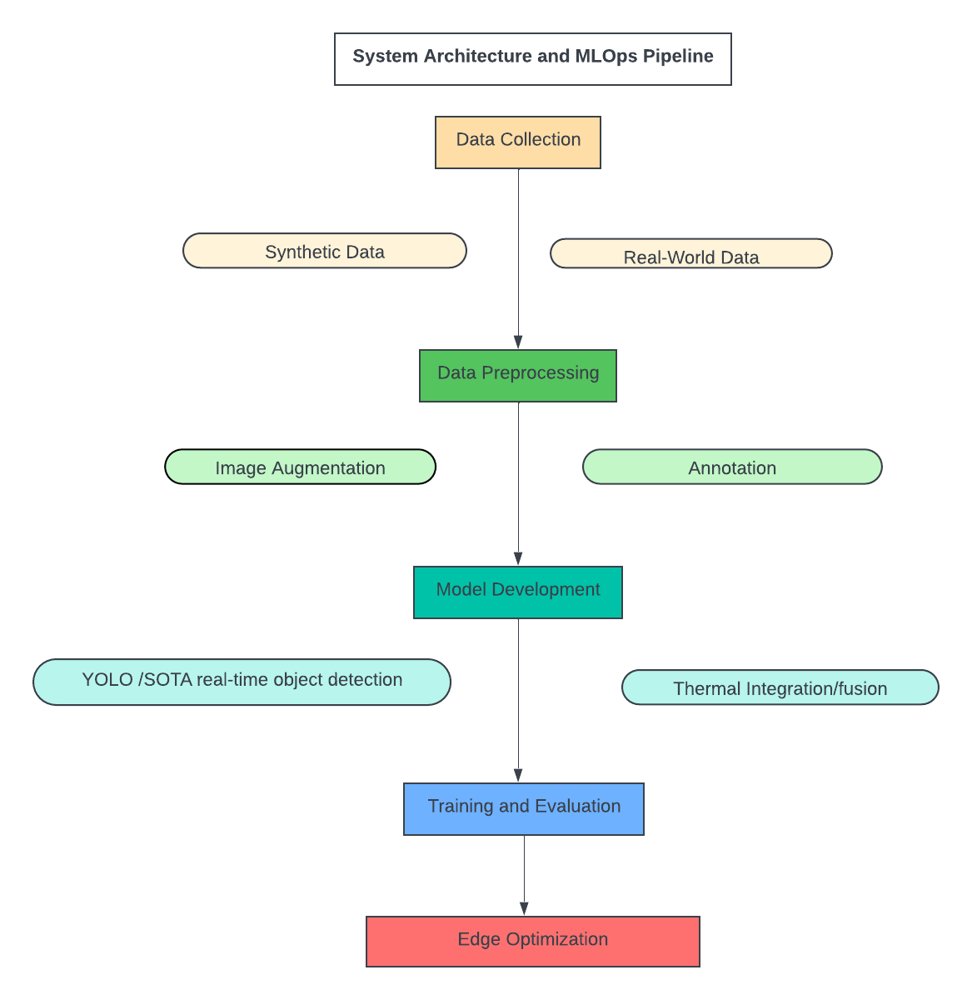

# Air-to-Air Drone Detection System

## Problem Definition
Detecting and tracking small, fast-moving drones from a fixed-wing UAV platform presents unique challenges in computer vision and real-time processing.

### Key Challenges
- **Small target size**: Drones appear as small objects in camera frames
- **High-speed platform**: Both observer and target are moving at high speeds
- **Changing perspectives**: Dynamic viewing angles and distances
- **Limited computing resources**: Onboard processing constraints
- **High accuracy requirements**: Minimizing false positives is critical

## System Architecture & MLOps Pipeline

The system follows a comprehensive MLOps approach integrating data collection, model development, deployment, and continuous improvement.

## Tools and Technologies

### Hardware
- **Compute Resources**: NVIDIA GPUs/cloud computing for model training
- **UAV Prototypes**: Equipped with various sensors for real-world testing
- **Onboard Cameras**: High-resolution RGB and thermal cameras

### Software
- **Deep Learning Frameworks**: TensorFlow, PyTorch for model development
- **Image Processing Libraries**: OpenCV for preprocessing and augmentation
- **Data Management**: Roboflow Supervision/LabelMe/OpenCV CVAT for dataset annotation
- **Programming Languages**: Python for prototyping, C++ for deployment

## Data Pipeline

### Data Collection
- **Synthetic Data**: Using simulation tools to generate diverse scenarios with varying lighting, weather, and backgrounds
- **Real-World Data**: Collecting data from UAV prototypes with both RGB and thermal cameras in different environments

### Data Preprocessing
- **Image Augmentation**: Rotation, scaling, noise addition to increase dataset robustness
- **Annotation**: Labeling drone positions in both synthetic and real images

## Model Development

### Initial Model Approach
- Start with pre-trained object detection models (YOLO or state-of-the-art real-time detection)
- Fine-tune with collected drone detection data
- Focus on small object detection optimization

### Thermal Integration
- Investigate models for fusing RGB and thermal data
- Experiment with different fusion techniques:
  - Early fusion (sensor level)
  - Feature-level fusion
  - Decision-level fusion

### Training and Evaluation
- **Training**: Utilize NVIDIA GPUs and cloud resources for model training on augmented datasets
- **Validation**: Split data ensuring diverse conditions are represented
- **Evaluation Metrics**: Precision, recall, and F1-score to minimize false positives
- **Edge Optimization**: Model pruning and quantization for deployment on resource-constrained UAVs
  - NVIDIA: TensorRT, TensorRT + PyTorch Quantization Toolkit
  - Intel: OpenVINO
  - CPU optimization: NeuralMagic

## Deployment Strategy

### Tracking Integration
- Combine tracking-by-detection with state-of-the-art re-identification (ReID) models
- Implement BoTSORT and ByteTrack for enhanced object tracking
- Maintain target identity across frames

### Post-Processing Optimization
- **Small Object Detection**: Implement [slicing aided hyper inference](https://learnopencv.com/slicing-aided-hyper-inference/) for improved small target detection
- **Post-Processing Analysis**: Conduct analysis and update state machines for decision-making flow
- **Action/Event Recognition**: Evaluate action/event recognition models based on tracking
- **State Machine Implementation**: Combine data from multiple sensors for enhanced decision-making

## Testing Strategy

### Simulation Testing
- **Initial Model Evaluation**: Test basic detection models in simulation to validate approach
- **Environmental Variability**: Assess model performance under different simulated conditions

### Real-World Testing
- **Prototype Testing**: Deploy models on UAV prototypes for real-world data collection
- **Iterative Improvement**: Use feedback from flight tests to refine models

### Feature Testing
#### Simulation
- Model accuracy with different camera resolutions and angles
- Impact of high-speed movement and changing perspectives

#### Real-World
- Detection accuracy in diverse environments
- False positive rates with birds and other objects

## RGB and Thermal Sensor Fusion

### Thermal Camera Advantages
- **Heat signature detection**: Detect drones based on motor/battery heat
- **Weather independence**: Less affected by lighting conditions
- **Camouflage resistance**: Thermal signatures harder to mask

### Thermal Camera Disadvantages
- **Lower resolution**: Typically lower spatial resolution than RGB
- **Environmental interference**: Affected by ambient temperature
- **Cost**: Higher cost compared to standard RGB cameras

### Fusion Methods
Multiple approaches for combining RGB and thermal data:
1. **Pixel-level fusion**: Direct combination of RGB and thermal pixels
2. **Feature-level fusion**: Combine extracted features from both modalities
3. **Decision-level fusion**: Combine detection results from separate RGB and thermal models

## Research References

The following research papers provide foundational knowledge for air-to-air drone detection:

- **[CF2Drone](papers/2404.19276v1.pdf)**: Advanced techniques for drone detection in challenging conditions
- **[TransViDrone](papers/2210.08423v2.pdf)**: Transformer-based approaches for video drone detection
- **[DogFight](papers/2103.17242v2.pdf)**: Air-to-air combat scenarios and detection strategies
- **[Additional Research](papers/2306.16175v3.pdf)**: Extended methodologies and comparative studies

## Integration with UAV Perception Lab Phases

This air-to-air detection system integrates with the main curriculum:

- **Phase 2**: Object detection & tracking foundations
- **Phase 3**: Embedded AI acceleration for real-time performance
- **Phase 4**: Sensor fusion techniques (RGB + thermal)
- **Phase 5**: Multi-drone scenarios and coordination
- **Phase 6**: Real drone testing and validation

## Next Steps

1. **Dataset Creation**: Collect and annotate comprehensive drone detection dataset
2. **Model Training**: Implement and train state-of-the-art detection models
3. **Fusion Development**: Develop RGB-thermal fusion algorithms
4. **Edge Optimization**: Optimize models for onboard deployment
5. **Real-world Testing**: Validate system performance in actual flight conditions